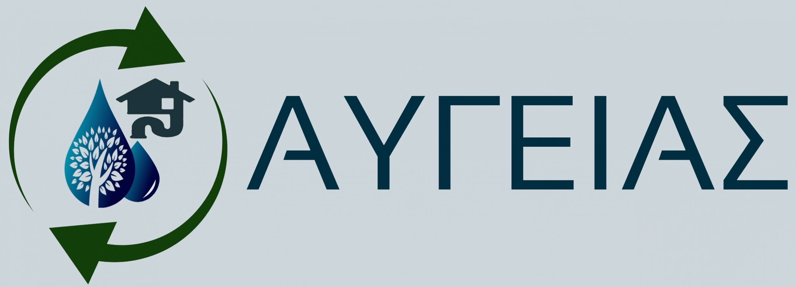

# Augeias post process API
(c) 2022, [xtc.codes](https://xtc.codes)

License: [MIT](LICENSE)

Author: [xtc.codes](https://xtc.codes)

Website: https://project-augeias.gr/

Version: 1.0.0

Description: Augeias post process API

Tags: augeias, post process, api

## Installation

    git clone https://github.com/firvain/augeias-post-api.git
    cd augeias-post-process-api
    yard install

## Usage

### Sensors Endpoints
Get data from a sensor from date 

    curl -X GET "http://localhost:3000/v1/{sensor}?from=YYYY-MM-DD" -H "accept: application/json"

Get all data from a sensor

    curl -X GET http://localhost:3000/v1/{sensor}/all
####  Available sensors:
- atmos
- aquatroll
- triscan
- proteus
- scanchlori
- teros
- addvantage

#### Example
    curl -X GET "http://localhost:3000/v1/addvantage?from=2022-09-28" -H "accept: application/json"

### Metrics Endpoints
Get metrics from a sensor from date

    curl -X GET "http://localhost:3000/v1/metrics/{dataset}?from=YYYY-MM-DD" -H "accept: application/json"

> Right now only the [MAPE](https://en.wikipedia.org/wiki/Mean_absolute_percentage_error) metric is calculated

####  Available datasets:
- openweather
- accuweather

#### Example
    curl -X GET "http://localhost:3000/v1/metrics/openweather?from=2022-09-28" -H "accept: application/json"
